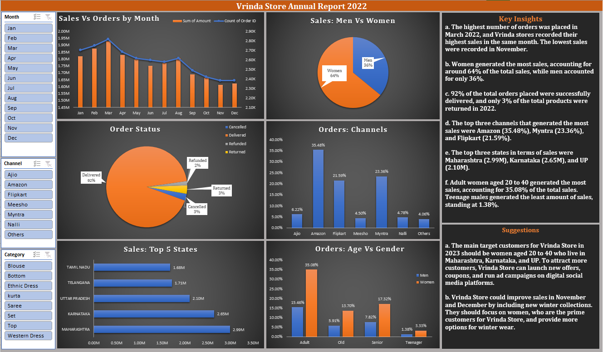

# End-to-End Data Analytics Project using Excel | Personal Project

1. Cleaned the data by identifying and removing duplicate records and null values, and addressing inconsistent data for gender and quantity columns.

2. Used Excel functions and formulas to create new features for analysis, including age buckets and month names from the date column.

3. Conducted data analysis to identify key insights, such as the highest sales in March 2022 and women generating the most sales.

4. Developed interactive visualizations and a comprehensive report to communicate the findings effectively to the client.

5. Proposed actionable recommendations based on the analysis, including targeting women aged 20 to 40 in Maharashtra, Karnataka, and UP with new offers and coupons.

6. Displayed strong communication and collaboration skills by sharing insights and suggestions with the client and working towards their goals of understanding their customers and growing 
their sales in 2023.
